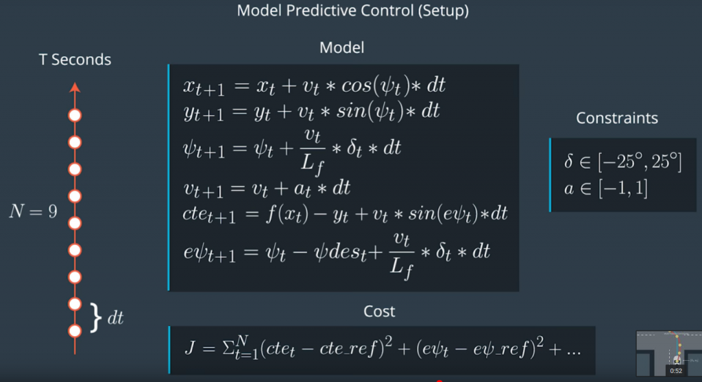

## Rubric Points

### The Model
The model used is a Kinematic model neglecting the complex interactions between the tires and the road.

The states for the model are:
* `x, y`: vehicle position
* `psi`: orientation angle
* `v`: velocity of the vehicle
* `cte`: cross-track error
* `epsi`: orientation error

The actuators are:
* `delta`: steering angle
* `a`:  acceleration

The model combines the state and actuations from the previous timestep to calculate the state for the current timestep based on the equations below:

The objective is to find the acceleration (`a`) and the steering angle (`delta`) in the way it will minimize an objective function that is the combination of different factors:

* Square sum of `cte` and `epsi`
* Square sum of the difference actuators to penalize a lot of actuator's actions
* Square sum of the difference between two consecutive actuator values to penalize sharp changes

### Timestep Length and Elapsed Duration (N & dt)

This project uses N=20 and dt=0.05. These values mean that the optimizer is considering a one-second duration in which to determine a corrective trajectory. The other values tried was N=10 and dt=0.1.

Weights for each cost item were tuned manually to find a working solution.
* 50, 100, 1 for the reference states
* 50, 50, for the actuators
* 25000, 5000 for sequential actuation

We use a large weight on the cost relates to the change of delta to ensure a smooth change of steering angle. The target speed is set for 100mph.ee

### Polynomial Fitting and MPC Preprocessing

A 3rd order polynomial is used to fit the waypoints. The fitting process is in the car coordinates, so that the waypoints are transformed from the map coordinates to the car coordinates (see `main.cpp` lines #103-113). These polynomial coefficients are used to calculate the `cte` and `epsi` later on. They are used by the solver as well to create a reference trajectory.

### Model Predictive Control with Latency

In order to account the latency, we use the solution from the solver at a t=0.1s delay (`Main.cpp` line #130-139, `MPC.cpp` line #238-241).

---